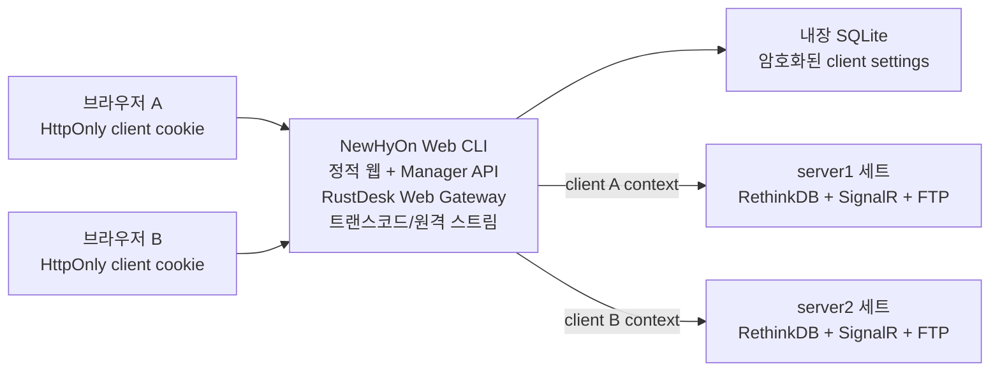

# NewHyOn 단일 Web CLI 멀티 클라이언트 구현 기준

- 문서 상태: 현재 구현·배포 기준
- 작성 기준일: 2026-07-14
- 구현 저장소: `NewHyOn_Web`
- 배포 단위: Windows x64, Linux x64, Linux arm64 단일 실행 파일
- 핵심 구조: 단일 CLI + 내장 SQLite DB + 브라우저 클라이언트별 연결 격리

## 1. 목표와 완료 조건

한 개의 Web CLI 주소에 여러 브라우저가 접속하더라도 각 브라우저가 선택한 NewHyOn 서버세트를 독립적으로 사용해야 한다.

완료 조건은 다음과 같다.

1. 브라우저 A가 server1을 저장한 뒤 브라우저 B가 server2를 저장해도 A는 server1을 유지한다.
2. 설정, RethinkDB 연결, SignalR 연결·heartbeat, FTP·트랜스코드 요청이 동일한 클라이언트 문맥을 사용한다.
3. 브라우저가 서버 접속정보를 헤더나 query string으로 반복 전송하지 않는다.
4. Web CLI 재시작 후에도 브라우저별 설정이 유지된다.
5. 설정 DB 원문에 서버 주소와 접속 비밀값이 평문으로 남지 않는다.
6. Linux 실행 시 ffmpeg가 없으면 내장 설치 스크립트가 자동 실행되고, 설치 검증 실패 시 CLI가 시작되지 않는다.
7. WPF Manager의 LiteDB와 서버세트 내부 `ServerSettings(id=0)`을 Web CLI가 수정하지 않는다.

## 2. 배포 구조



단일 실행 파일에는 다음 기능이 함께 들어간다.

- Vite로 빌드한 Manager 웹 화면
- `/api/manager/*` 서버 API
- RustDesk 웹클라이언트 정적 자산과 `/rustdesk-ws` 프록시
- ffmpeg/ffprobe 기반 FTP 콘텐츠 탐색·썸네일·트랜스코드 스트림
- `/ws`, `/api/remote/*` 원격 스트리밍 게이트웨이
- 브라우저별 설정을 저장하는 Node 내장 SQLite

RustDesk의 hbbs/hbbr와 NewHyOn의 RethinkDB, SignalR, FTP 서버 자체는 CLI 외부 서비스다. RustDesk 게이트웨이 기본 서버와 원격 스트리밍 장치 등록은 CLI 인스턴스 공용 인프라이며, 클라이언트별로 갈리는 NewHyOn 서버 연결은 RethinkDB·SignalR·FTP 설정이다.

## 3. 클라이언트 식별과 저장

### 3.1 식별자

`server/managerClientStore.js`가 최초 Manager API 요청에서 32바이트 난수 토큰을 만든다.

- HTTPS: `__Host-newhyon_client`
- HTTP 개발·내부망 모드: `newhyon_client`
- 속성: `HttpOnly`, `SameSite=Lax`, `Path=/`
- HTTPS 쿠키에는 `Secure`를 추가한다.
- HTTPS 요청은 HTTP용 쿠키를 신뢰하지 않는다.
- DB에는 토큰 원문 대신 SHA-256 해시만 저장한다.

이 식별 단위는 물리 장비가 아니라 브라우저 프로필이다. 같은 장비라도 다른 브라우저·프로필은 서로 다른 설정을 가지며, 쿠키를 삭제하면 새 클라이언트로 등록된다.

### 3.2 내장 DB

기본 런타임 파일은 실행 파일 옆 `newhyon-data`에 생성한다.

```text
newhyon-data/
  manager.local.settings.json     최초 클라이언트용 seed(선택)
  manager-clients.sqlite          클라이언트별 설정 DB
  manager-clients.sqlite.key      AES-256 키
  GroupLogos/
  rustdesk-webclient/
  tools/
```

`manager_clients` 행은 `client_id`, 암호화된 설정, revision, 생성·수정·마지막 접근 시각을 가진다. 설정 JSON은 AES-256-GCM으로 암호화한다. 키 파일은 POSIX에서 `0600`으로 제한하고 Windows에서는 실행 계정 ACL을 따른다. DB와 키는 반드시 함께 백업하되 별도 접근권한으로 관리한다.

`manager.local.settings.json`은 기존 설치값을 최초 행에 복제하기 위한 읽기 전용 seed다. 브라우저 설정 저장 시 이 파일이나 원격 `ServerSettings`를 갱신하지 않는다.

## 4. 요청과 연결 격리

### 4.1 요청 문맥

`server/managerRethinkApi.js`는 Manager API 요청마다 쿠키를 내장 DB 행으로 해석하고 다음 불변 문맥을 만든다.

```text
ManagerRequestContext
  clientId
  revision
  settings snapshot
  acquired Rethink entry
```

이 문맥은 `AsyncLocalStorage.run()` 범위 안에서만 사용한다. 요청 중 다른 브라우저가 설정을 저장해도 현재 요청의 snapshot은 바뀌지 않는다.

### 4.2 RethinkDB

연결 키는 다음 값의 조합이다.

```text
clientId : settingsRevision : sha256(rethink connection config)
```

따라서 서버 주소가 같더라도 클라이언트 문맥은 섞이지 않는다. 요청이 연결을 획득하면 참조 수를 올리고 `finally`에서 내린다. 설정 변경으로 폐기된 연결은 진행 중인 요청이 모두 끝난 후 drain한다.

### 4.3 SignalR와 heartbeat

SignalR 상태 키는 `clientId:settingsRevision`이다. 연결 객체, URL, 연결 Promise, 재접속 타이머, heartbeat Map을 상태 객체 안에 함께 둔다. 콜백은 해당 상태를 직접 캡처하므로 다른 브라우저의 전역 연결이나 heartbeat를 참조하지 않는다.

### 4.4 FTP와 트랜스코드

FTP 목록, 업로드, 콘텐츠 스트림, 썸네일, ffprobe, ffmpeg URL은 요청 문맥의 `settings.ftp`에서 만든다. 브라우저가 FTP 비밀번호를 받거나 URL query에 넣지 않는다.

### 4.5 연결 수명과 과부하 보호

- 유휴 연결 만료: 30분
- 청소 주기: 5분
- RethinkDB 상태 최대 수: 256
- SignalR 상태 최대 수: 256
- 최대치를 넘으면 `503 / MANAGER_CONNECTION_CAPACITY`로 명확히 실패한다.

무제한 연결 누적을 허용하지 않으며, 다른 클라이언트 연결을 임의로 닫아 자리를 만들지 않는다.

## 5. 설정 변경 계약

`GET /api/manager/settings`는 현재 쿠키의 설정만 반환한다. DB·SignalR·FTP 비밀번호는 반환하지 않는다.

`POST /api/manager/settings`는 현재 행의 revision이 요청 시작 시점과 같을 때만 저장한다. 같은 브라우저의 다른 요청이 먼저 저장했으면 `409 / CLIENT_SETTINGS_CONFLICT`를 반환한다. 성공하면 revision을 증가시키고 이전 revision의 RethinkDB·SignalR 상태만 폐기한다.

설정 조회와 접속 비밀번호 검증은 대상 데이터 서버의 접속 성공 여부에 의존하지 않는다. 실제 데이터 API는 선택된 서버에 연결할 수 없으면 해당 요청을 실패시킨다.

브라우저 코드 `src/services/managerApi.js`는 같은 origin의 HttpOnly 쿠키를 자동 사용하며, raw 설정 헤더·query·localStorage 전송 경로를 갖지 않는다.

## 6. Linux ffmpeg 자동 설치

CLI 시작 순서는 다음과 같다.

1. `--ffmpeg` 또는 `NEWHYON_FFMPEG_PATH`가 지정됐으면 실제 실행 검증
2. Windows면 내장 `ffmpeg.exe` 추출 및 검증
3. 런타임 도구 폴더와 시스템 PATH에서 ffmpeg 확인
4. Linux에서 없으면 CLI에 포함된 `scripts/install-system-deps.sh`를 런타임 폴더에 기록
5. `/bin/sh`로 스크립트 실행
6. `apt`, `dnf`, `yum`, `zypper`, `pacman`, `apk` 중 발견한 패키지 관리자로 설치
7. `ffmpeg -version` 성공 확인 후에만 웹서버 시작

권한이 필요한 경우 root 또는 `sudo`가 필요하다. 지원 패키지 관리자가 없거나 저장소에서 ffmpeg를 설치하지 못하면 프로세스를 오류 종료한다. 트랜스코드 기능이 없는 불완전한 상태로 서버를 열지 않는다.

## 7. Windows Manager 호환 경계

WPF Manager는 기존대로 각 설치의 LiteDB를 사용한다.

- `Manager/NewHyOn_Manager/TurtleTools/LocalDbContext.cs`
- `Manager/NewHyOn_Manager/TurtleTools/LocalSettingsStore.cs`
- `Manager/NewHyOn_Manager/DataManager/ServerSettingsManager.cs`

Web CLI 구현은 위 코드를 변경하지 않는다. 또한 Web CLI의 브라우저 설정 저장은 RethinkDB `ServerSettings(id=0)`에 쓰지 않는다. 해당 레코드는 기존 Windows Player가 이미 선택된 서버세트 안에서 Message Server와 FTP 정보를 찾는 용도로 계속 사용할 수 있다.

즉 저장 경계는 다음처럼 분리한다.

| 설정 주체 | 저장 위치 | 다른 주체에 미치는 영향 |
|---|---|---|
| WPF Manager | 각 설치의 LiteDB | 기존 동작 유지 |
| Windows Player | 각 설치의 LiteDB + 선택 서버의 ServerSettings 읽기 | 기존 동작 유지 |
| Web 브라우저 | Web CLI의 암호화 SQLite 행 | 같은 쿠키의 브라우저에만 적용 |

## 8. 빌드와 검증

소스 검증:

```bash
npm test
npm run lint
npm run build
```

CLI 패키징:

```bash
npm run build:windows-cli
npm run build:linux-cli
```

빌드기는 Windows 그룹과 Linux 그룹을 분리한다. Windows SEA에만 `ffmpeg.exe`를 넣고 Linux SEA에는 설치 스크립트만 넣는다. Node 의존성은 실행 파일 내부 번들에 포함하며 배포 대상에 `node_modules`를 복사하지 않는다.

자동 테스트 `server/managerClientIsolation.test.js`는 실제 HTTP Manager API를 띄워 다음을 검증한다.

1. 쿠키가 다른 두 클라이언트 생성
2. server1과 server2 각각 저장
3. 두 클라이언트의 동시 반복 저장
4. 최종 서버 주소와 revision 독립성
5. 저장소를 닫고 다시 연 뒤 두 설정의 영속성
6. SQLite 파일에 서버 주소 평문이 없는지 확인

릴리스 전 수동 검증은 서로 다른 두 브라우저 프로필에서 같은 CLI 주소를 열어 각각 다른 실제 서버세트로 페이지·플레이어·FTP 콘텐츠·live state가 분리되는지 확인한다. Windows Manager에서도 기존 LiteDB 설정과 플레이어 접속이 변하지 않았는지 함께 확인한다.

Linux 릴리스는 ffmpeg가 없는 깨끗한 배포판 환경에서도 실행해 설치 스크립트 수행, ffmpeg 실행 검증, Web CLI 기동, 두 쿠키의 설정 격리까지 확인한다.

## 9. SaaS 확장 시점

현재 구조는 한 조직이 한 CLI 인스턴스를 직접 운영하는 온프레미스·단일 노드 배포에 맞춘다. 다음 요구가 생기면 [web-multi-server-commercial-architecture.md](./web-multi-server-commercial-architecture.md)로 확장한다.

- 사용자 계정과 조직별 권한
- 같은 작업공간을 여러 사용자와 공유
- 다중 Web Gateway 인스턴스와 무중단 배포
- 중앙 감사 로그와 비밀 저장소
- 서버 프로필 승인·회전·폐기
- 사용량 과금과 테넌트별 제한
