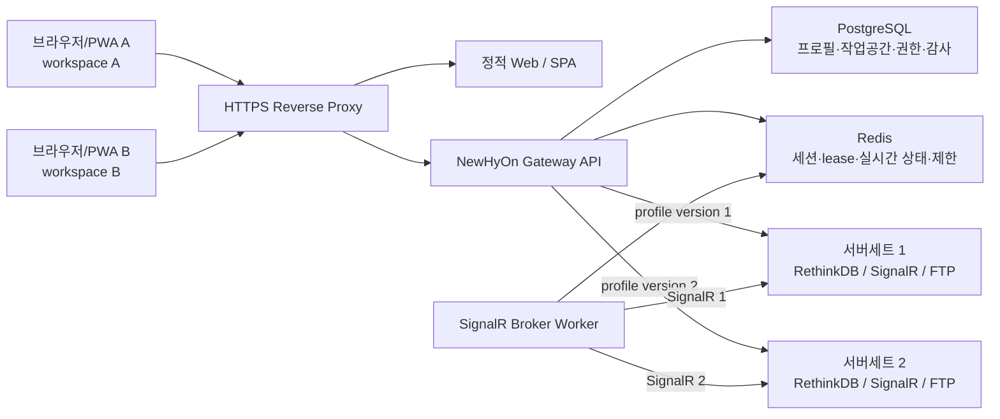
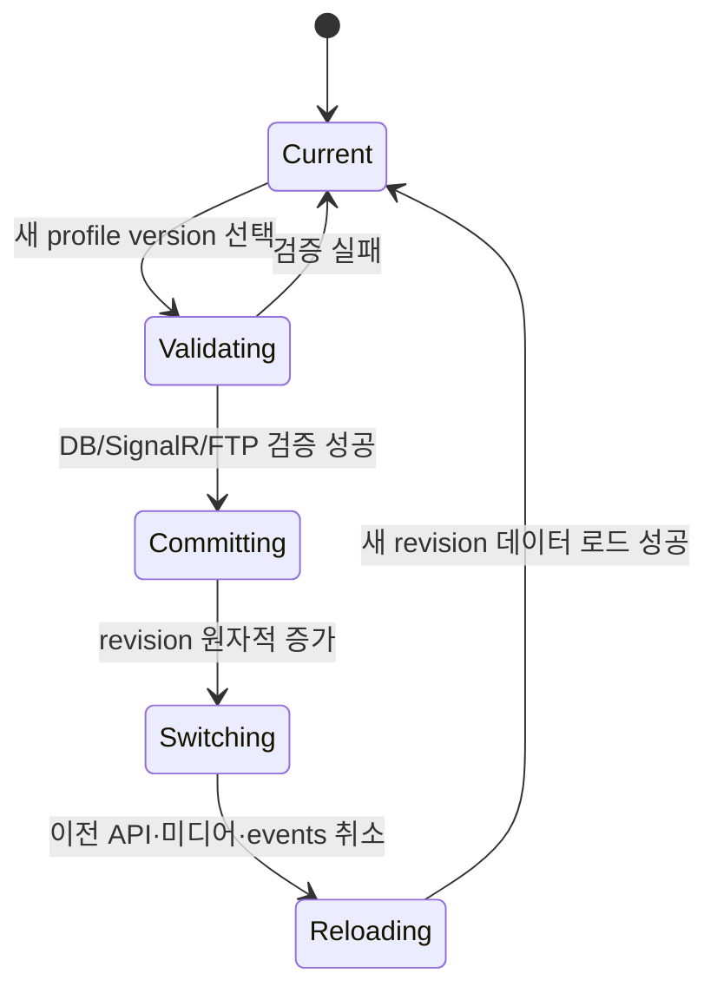

# NewHyOn 웹 멀티 서버세트 중계 상용 SaaS 확장안

- 문서 상태: 장기 상용 SaaS 확장안으로 보관
- 작성 기준일: 2026-07-14
- 적용 대상: `NewHyOn`, `NewHyOn_Web`, `NewHyOn_Web_SPA`
- 핵심 목표: 동일한 웹 접속 주소를 사용하더라도 각 웹 작업공간이 서로 다른 NewHyOn 서버세트를 선택하고, 어떤 동시 요청에서도 다른 서버세트의 데이터·명령·미디어가 섞이지 않게 한다.

> 현재 배포·구현 기준은 [web-cli-multi-client-implementation.md](./web-cli-multi-client-implementation.md)이다. 이 문서는 중앙 제어 DB, 조직·사용자 권한, 다중 인스턴스, 감사와 비밀 저장소가 필요한 SaaS 단계에서 적용한다.

## 1. 결론

한 개의 공개 웹서비스가 여러 NewHyOn 서버세트를 중계하는 구조는 상용서비스로 구현할 수 있다. 다만 서버 선택값과 연결 객체를 웹 프로세스 전역 변수로 두어서는 안 된다.

목표 구조에서는 다음 원칙을 반드시 지킨다.

1. 브라우저는 서버 IP, DB 계정, FTP 계정 같은 접속정보를 매 요청마다 보내지 않는다.
2. 브라우저는 권한이 확인된 불투명한 `workspaceId`만 사용한다.
3. 서버세트 접속정보와 비밀값은 중앙 제어 저장소에 서버 측 데이터로 보관한다.
4. 모든 Manager API·미디어·실시간 통신 URL은 `workspaceId`와 `workspaceRevision`으로 범위를 고정한다.
5. Gateway는 요청 시작 시 하나의 불변 `ServerContext`를 확정하고 요청이 끝날 때까지 바꾸지 않는다.
6. RethinkDB, SignalR, heartbeat, FTP 작업 제한, 변환 캐시는 모두 `serverProfileVersionId` 단위로 분리한다.
7. 서버 문맥을 찾지 못하면 요청을 실패시킨다. 기본 서버, 마지막 서버, 전역 설정 파일로 대체하지 않는다.
8. `ServerSettings(id=0)`은 해당 서버세트 내부의 플레이어 서비스 탐색 정보로만 사용한다. 웹클라이언트가 어느 서버세트를 선택했는지를 저장하지 않는다.

이 문서에서 확정한 상용 구조는 `브라우저 → NewHyOn Gateway → 선택된 서버세트`이다. 현재 두 웹 저장소에 중복된 서버 중계 코드는 장기적으로 하나의 독립 Gateway 서비스로 통합한다.

## 2. 용어와 보장 범위

### 2.1 서버세트

하나의 운영 단위를 이루는 다음 서비스 묶음이다.

- RethinkDB
- SignalR Message Server
- FTP 저장소와 passive port 범위
- 선택적으로 RustDesk 및 원격제어 대상

`serverProfile`은 서버세트의 논리적 이름이고, `serverProfileVersion`은 실제 접속 주소와 자격증명이 고정된 불변 버전이다.

### 2.2 작업공간

`workspace`는 웹에서 서버세트를 선택하는 최소 격리 단위다. 물리적 기기 자체를 브라우저만으로 신뢰성 있게 식별할 수는 없으므로 상용 제품에서 말하는 “기기별 설정”은 정확히 다음처럼 정의한다.

- 기본: 브라우저 프로필 또는 설치된 PWA별 작업공간
- 같은 브라우저에서 탭별로 다른 서버가 필요할 때: 서로 다른 `/w/{workspaceId}` 주소
- 관리형 물리 기기 식별이 필요할 때: 별도 등록 토큰 또는 WebAuthn 기반 기기 등록

같은 접속페이지 `/`를 사용하면 최초 로그인 시 브라우저 설치 ID를 등록하고 해당 설치 전용 private workspace를 만든다. 이후에는 그 브라우저의 마지막 작업공간으로 이동한다. 설치 ID와 마지막 workspace ID는 비밀값이 아니며 브라우저 저장소에 둘 수 있지만, 권한 판정에는 사용하지 않는다. 브라우저 저장소가 지워지면 새 설치와 private workspace를 만들고 기존 workspace 데이터는 삭제하지 않는다. 실제 관리 화면 주소와 모든 내부 요청은 `/w/{workspaceId}` 문맥을 가진다.

## 3. 현재 코드에서 확인된 구조

### 3.1 WPF Manager와 Windows Player

`NewHyOn`의 WPF Manager 설정은 로컬 LiteDB에 저장된다.

- `Manager/NewHyOn_Manager/TurtleTools/LocalDbContext.cs`
  - 실행 설치본의 `Data/local.db`를 연다.
- `Manager/NewHyOn_Manager/TurtleTools/LocalSettingsStore.cs`
  - `local_connection`, `local_ftp`, `local_ui` 컬렉션을 사용한다.
  - `SaveConnectionSettings`, `SaveFtpSettings`, `SaveUiSettings`는 로컬 DB만 갱신한다.
- `Manager/NewHyOn_Manager/DataManager/ServerSettingsManager.cs`
  - 위 로컬 컬렉션을 읽고 쓴다.

최초 로컬 DB 생성 시 `TryMigrateServerSettingsFromRethink`가 원격 `ServerSettings`를 읽을 수 있지만, 현재 코드는 FTP/UI 초기 이관만 수행하며 Rethink 접속 호스트 자체를 다른 Manager에 동기화하지 않는다. 따라서 서로 다른 설치 폴더 또는 기기의 WPF Manager끼리 서버 선택이 자동 동기화되는 구조는 아니다.

Windows Player도 `LocalSettingsManager`가 로컬 LiteDB의 `ManagerIP`를 보유한다. `ServerSettingsClient`는 그 로컬 `ManagerIP`로 접속한 RethinkDB의 `ServerSettings(id=0)`에서 Message Server와 FTP 정보를 읽는다. 즉 `ServerSettings(id=0)`은 이미 선택된 서버세트 안에서 부속 서비스를 찾기 위한 데이터다.

### 3.2 기존 웹서버의 직접 원인

두 웹 프로젝트의 `server/managerRethinkApi.js`는 다음 상태를 프로세스 전역 단일값으로 관리한다.

- `SETTINGS_FILE_PATH`와 `cachedManagerSettings`
- `rethinkClient`와 `rethinkClientSignature`
- `managerSignalRConnection`, 재연결 타이머
- `managerSignalRHeartbeats`
- 일부 원격 세션 Map

기존 저장 경로는 기본적으로 `server/data/manager.local.settings.json` 하나다. 같은 웹 프로세스에 접속한 모든 브라우저가 이 설정과 연결 객체를 공유했다. 한 브라우저가 server2를 저장하면 이후 다른 브라우저 요청도 server2용 전역 연결을 사용하게 되는 것이 현재 문제의 직접 경로다.

`NewHyOn_Web_SPA/src/App.jsx`는 브라우저 `localStorage`에도 설정을 기록하지만, 기존 API 요청에는 선택 서버 문맥이 없었다. 로그인과 SignalR 재연결 과정에서 `/api/manager/settings` 응답을 다시 로컬에 기록하므로 서버의 전역값이 다른 브라우저의 로컬값을 덮을 수 있었다.

### 3.3 현재 작업트리의 임시 변경은 상용안이 아니다

현재 작업트리에는 raw 설정을 `X-NewHyOn-Manager-Settings` 헤더 또는 `managerSettings` query에 넣고 `AsyncLocalStorage`로 읽는 미커밋 변경이 존재한다. 이 변경은 원인 확인용 방향에 가깝고 다음 이유로 상용 구조로 채택하지 않는다.

- ``, `<video>`와 일부 직접 `fetch` 요청에는 사용자 정의 헤더가 일관되게 붙지 않는다.
- query string에 설정을 넣으면 브라우저 기록, 프록시 로그, 접근 로그에 값이 남는다.
- 클라이언트가 임의 호스트를 지정할 수 있어 SSRF와 내부망 탐색 통로가 된다.
- `rethinkClient`와 SignalR 연결은 여전히 전역 단일 객체여서 동시 요청 중 다른 연결이 닫히거나 교체될 수 있다.
- 설정 헤더가 없을 때 전역 파일로 대체하는 동작은 다시 교차 연결을 만든다.
- `toPublicManagerSettings`와 클라이언트 저장 모델에 접속 비밀번호 필드가 포함될 수 있어 인증정보 노출 위험이 있다.
- `NewHyOn_Web`의 미디어·로고 URL 생성기는 현재 해당 문맥을 모두 전달하지 않는다.
- `DashboardFooter`는 `savedToRemote === false`를 저장 실패로 처리하므로 현재 임시 서버 응답과 UI 계약도 일치하지 않는다.

구현 시 이 임시 방식을 확장하지 않고 본 문서의 workspace/profile 구조로 대체한다.

## 4. 목표 아키텍처



공개 도메인은 하나여도 된다. Reverse Proxy는 정적 프런트엔드와 Gateway를 같은 origin으로 제공한다.

```text
https://newhyon.example.com/                    로그인/작업공간 선택
https://newhyon.example.com/w/{workspaceId}     관리 화면
https://newhyon.example.com/api/v2/...          Gateway API
https://newhyon.example.com/media/v2/...        미디어 중계
https://newhyon.example.com/events/v2/...       브라우저 실시간 이벤트
```

상용 배포에서는 논리적으로 하나의 웹서비스를 제공하되, 프로세스는 정적 UI, Gateway API, SignalR Broker Worker로 분리한다. Gateway 인스턴스는 상태를 로컬 파일에 저장하지 않으며 수평 확장 가능해야 한다.

## 5. 설정 소유권

| 값 | 권위 저장소 | 범위 | 브라우저 반환 여부 |
|---|---|---|---|
| 선택된 서버세트 | PostgreSQL `workspaces.active_profile_version_id` | 작업공간별 | ID와 표시명만 |
| Rethink/SignalR/FTP 주소 | PostgreSQL `server_profile_versions` | 서버 프로필 버전별 | 관리 권한이 있을 때 마스킹된 값만 |
| DB/FTP 비밀번호 | 암호화된 `server_profile_secrets` | 서버 프로필 버전별 | 반환 금지 |
| 웹 로그인 비밀번호 | Argon2id 해시 | 사용자별 | 반환 금지 |
| 세션 | Redis | 로그인 세션별 | HttpOnly cookie의 불투명 ID만 |
| 화면 언어·패널 상태 | 브라우저 저장소 | 브라우저 프로필별 | 해당 없음 |
| `preserveAspectRatio` 같은 미리보기 취향 | 브라우저 또는 workspace preference | 작업공간별 | 허용 |
| Player 서비스 탐색용 `ServerSettings(id=0)` | 각 서버세트의 RethinkDB | 서버세트 내부 | 웹 서버 선택에 사용 금지 |
| WPF Manager 접속 설정 | 설치본의 LiteDB | 설치본별 | 웹과 동기화하지 않음 |

`accessPassword`, `forcePasswordChange`, `idleTimeoutMinutes`는 현재 하나의 UI 설정 객체에 섞여 있으나 구현 시 분리한다. 웹 인증정책은 중앙 인증/세션 정책으로 이동하고, 화면 취향만 workspace preference에 둔다.

## 6. 중앙 데이터 모델

운영 제어 데이터는 PostgreSQL을 권위 저장소로 사용한다. RethinkDB는 각 고객 서버세트의 업무 데이터 저장소로 계속 사용한다.

핵심 스키마는 다음과 같다. 실제 migration은 UUID 기본값, timestamp trigger, 외래키 인덱스를 포함해 작성한다.

```sql
create table tenants (
  id uuid primary key,
  name text not null,
  created_at timestamptz not null default now()
);

create table users (
  id uuid primary key,
  email text not null unique,
  password_hash text not null,
  status text not null check (status in ('active', 'locked', 'disabled')),
  created_at timestamptz not null default now()
);

create table tenant_memberships (
  tenant_id uuid not null references tenants(id),
  user_id uuid not null references users(id),
  role text not null check (role in ('owner', 'admin', 'operator', 'viewer')),
  primary key (tenant_id, user_id)
);

create table sites (
  id uuid primary key,
  tenant_id uuid not null references tenants(id),
  name text not null,
  network_mode text not null check (network_mode in ('direct', 'wireguard')),
  allowed_cidrs cidr[] not null,
  status text not null check (status in ('active', 'disabled')),
  unique (tenant_id, name),
  unique (id, tenant_id)
);

create table server_profiles (
  id uuid primary key,
  tenant_id uuid not null references tenants(id),
  site_id uuid not null,
  name text not null,
  status text not null check (status in ('active', 'disabled')),
  created_at timestamptz not null default now(),
  unique (tenant_id, name),
  unique (id, tenant_id),
  foreign key (site_id, tenant_id) references sites(id, tenant_id)
);

create table server_profile_secrets (
  id uuid primary key,
  tenant_id uuid not null references tenants(id),
  vault_ciphertext text not null,
  key_version text not null,
  created_at timestamptz not null default now(),
  unique (id, tenant_id)
);

create table server_profile_versions (
  id uuid primary key,
  tenant_id uuid not null references tenants(id),
  profile_id uuid not null,
  version integer not null,
  rethink_host text not null,
  rethink_port integer not null check (rethink_port between 1 and 65535),
  rethink_database text not null,
  rethink_user text not null,
  signalr_origin text not null,
  signalr_hub_path text not null,
  ftp_host text not null,
  ftp_port integer not null check (ftp_port between 1 and 65535),
  ftp_pasv_min_port integer not null check (ftp_pasv_min_port between 1 and 65535),
  ftp_pasv_max_port integer not null check (ftp_pasv_max_port between 1 and 65535),
  ftp_user text not null,
  ftp_root_path text not null,
  secret_id uuid not null,
  config_fingerprint text not null,
  status text not null check (status in ('draft', 'validated', 'retired')),
  validated_at timestamptz,
  created_by uuid not null references users(id),
  created_at timestamptz not null default now(),
  unique (profile_id, version),
  unique (id, tenant_id),
  check (ftp_pasv_min_port <= ftp_pasv_max_port),
  foreign key (profile_id, tenant_id) references server_profiles(id, tenant_id),
  foreign key (secret_id, tenant_id) references server_profile_secrets(id, tenant_id),
  foreign key (tenant_id, created_by) references tenant_memberships(tenant_id, user_id)
);

create table client_installations (
  id uuid primary key,
  tenant_id uuid not null references tenants(id),
  owner_user_id uuid not null references users(id),
  display_name text not null,
  created_at timestamptz not null default now(),
  last_seen_at timestamptz not null default now(),
  unique (id, tenant_id),
  foreign key (tenant_id, owner_user_id) references tenant_memberships(tenant_id, user_id)
);

create table workspaces (
  id uuid primary key,
  tenant_id uuid not null references tenants(id),
  name text not null,
  scope text not null check (scope in ('private', 'shared')),
  owner_installation_id uuid,
  active_profile_version_id uuid,
  revision bigint not null default 1,
  status text not null check (status in ('active', 'disabled')),
  created_by uuid not null references users(id),
  created_at timestamptz not null default now(),
  unique (id, tenant_id),
  foreign key (owner_installation_id, tenant_id) references client_installations(id, tenant_id),
  foreign key (active_profile_version_id, tenant_id) references server_profile_versions(id, tenant_id),
  foreign key (tenant_id, created_by) references tenant_memberships(tenant_id, user_id),
  check (
    (scope = 'private' and owner_installation_id is not null)
    or (scope = 'shared' and owner_installation_id is null)
  )
);

create table workspace_members (
  tenant_id uuid not null references tenants(id),
  workspace_id uuid not null,
  user_id uuid not null references users(id),
  role text not null check (role in ('admin', 'operator', 'viewer')),
  primary key (workspace_id, user_id),
  foreign key (workspace_id, tenant_id) references workspaces(id, tenant_id),
  foreign key (tenant_id, user_id) references tenant_memberships(tenant_id, user_id)
);

create table audit_events (
  id uuid primary key,
  tenant_id uuid not null references tenants(id),
  actor_user_id uuid references users(id),
  workspace_id uuid references workspaces(id),
  profile_version_id uuid references server_profile_versions(id),
  action text not null,
  result text not null,
  request_id text not null,
  source_ip inet,
  metadata jsonb not null default '{}'::jsonb,
  created_at timestamptz not null default now(),
  foreign key (tenant_id, actor_user_id) references tenant_memberships(tenant_id, user_id),
  foreign key (workspace_id, tenant_id) references workspaces(id, tenant_id),
  foreign key (profile_version_id, tenant_id) references server_profile_versions(id, tenant_id)
);
```

복합 외래키는 애플리케이션 버그가 있어도 다른 tenant의 site, secret, profile version을 workspace에 연결하지 못하게 한다. tenant별 PostgreSQL Row Level Security도 함께 활성화하고 각 transaction 시작 시 검증된 tenant context를 설정한다.

프로필 버전은 생성 후 수정하지 않는다. 주소나 자격증명이 바뀌면 `draft` 새 버전을 만들고 연결 검증에 성공하면 `validated`로 전환한 뒤 명시적으로 workspace binding을 전환한다. `retired` 버전은 신규 binding을 금지한다. 하나의 프로필을 여러 작업공간이 공유하더라도, 작업공간 전환과 프로필 전체 갱신을 서로 다른 행위로 분리해 의도하지 않은 동시 변경을 막는다. 기본 생성 workspace는 설치 전용 `private`이고, 사용자가 명시적으로 만든 `shared` workspace만 여러 설치에서 같은 선택값을 공유한다. 최초 private workspace는 active profile이 없는 상태로 생성할 수 있으며, 이때 Manager 요청은 선택 화면 외에는 모두 실패한다.

비밀값 payload에는 `rethinkPassword`, `ftpPassword`만 포함하고 HashiCorp Vault Transit의 encrypt/decrypt API로 처리한다. PostgreSQL에는 `vault:vN:...` ciphertext와 key version만 저장한다. production profile은 Vault 연결과 key가 없으면 시작 자체를 실패시키며 애플리케이션 설정 파일과 DB에 평문 키를 두지 않는다.

## 7. 세션과 권한

### 7.1 세션

- cookie 이름: `__Host-newhyon_session`
- 속성: `Secure; HttpOnly; Path=/; SameSite=Lax`
- cookie 값: 256비트 난수 세션 ID
- Redis key: `session:{sha256(sessionId)}`
- idle TTL과 absolute TTL을 모두 둔다.
- 로그인 성공 및 권한 상승 시 세션 ID를 회전한다.
- 브라우저 `localStorage`에는 세션, 비밀번호, 서버 접속정보를 저장하지 않는다.

Redis 세션에는 `userId`, `tenantId`, 허용된 role, CSRF secret, 생성시각, 마지막 활동시각만 저장한다. 작업공간은 URL에서 명시하고 매 요청 DB/권한 캐시로 검증한다.

### 7.2 권한

- `viewer`: 조회와 미디어 열람
- `operator`: 페이지·스케줄·플레이어 명령 수행
- `admin`: workspace의 서버 프로필 전환
- tenant `admin/owner`: 서버 프로필 생성, 새 버전 생성, 자격증명 갱신

상태 변경 요청은 세션 cookie와 `X-CSRF-Token`을 함께 검증한다. 서버 프로필 변경, 작업공간 전환, 플레이어 명령, 업로드는 모두 감사로그를 남긴다.

## 8. API 계약

### 8.1 작업공간과 프로필

```text
POST   /api/v2/auth/login
POST   /api/v2/auth/logout
POST   /api/v2/client-installations/register
GET    /api/v2/workspaces
POST   /api/v2/workspaces
GET    /api/v2/workspaces/{workspaceId}/context
PUT    /api/v2/workspaces/{workspaceId}/binding
GET    /api/v2/server-profiles
POST   /api/v2/server-profiles
POST   /api/v2/server-profiles/{profileId}/versions
POST   /api/v2/server-profile-versions/{versionId}/validate
```

작업공간 전환 요청은 낙관적 잠금을 사용한다.

```json
PUT /api/v2/workspaces/4b8.../binding
{
  "profileVersionId": "a72...",
  "expectedRevision": 7
}
```

```json
200 OK
{
  "workspaceId": "4b8...",
  "profile": { "id": "6fc...", "versionId": "a72...", "name": "서울 2센터" },
  "revision": 8
}
```

동시에 다른 전환이 끝났다면 `409 WORKSPACE_REVISION_CONFLICT`를 반환한다. 전환 API는 새 프로필의 RethinkDB·SignalR·FTP 검증이 모두 통과하기 전에는 DB binding을 갱신하지 않는다.

### 8.2 Manager API

기존 `/api/manager/*`는 아래처럼 작업공간 범위를 반드시 포함하도록 변경한다.

```text
/api/v2/workspaces/{workspaceId}/manager/pages
/api/v2/workspaces/{workspaceId}/manager/page-definition/{pageName}
/api/v2/workspaces/{workspaceId}/manager/schedules
/api/v2/workspaces/{workspaceId}/manager/players
/api/v2/workspaces/{workspaceId}/manager/commands
/api/v2/workspaces/{workspaceId}/manager/health
```

모든 응답은 다음 헤더를 포함한다.

```text
X-NewHyOn-Workspace-Id: {workspaceId}
X-NewHyOn-Workspace-Revision: {revision}
X-NewHyOn-Request-Id: {requestId}
```

클라이언트는 응답 revision이 현재 화면 revision과 다르면 응답 데이터를 상태에 반영하지 않는다.

### 8.3 미디어와 파일

사용자 정의 헤더를 붙일 수 없는 ``와 `<video>` 요청 때문에 raw 설정 query를 사용하지 않는다. URL 자체에 작업공간과 revision을 포함한다.

```text
GET  /media/v2/workspaces/{workspaceId}/revisions/{revision}/content/{fileId}
GET  /media/v2/workspaces/{workspaceId}/revisions/{revision}/content/{fileId}/thumbnail?t=10
GET  /media/v2/workspaces/{workspaceId}/revisions/{revision}/pages/{pageId}/thumbnail
GET  /media/v2/workspaces/{workspaceId}/revisions/{revision}/groups/{groupId}/logo
POST /api/v2/workspaces/{workspaceId}/revisions/{revision}/content/uploads
```

- 같은 origin의 HttpOnly session cookie로 권한을 확인한다.
- `revision`이 현재 workspace revision과 다르면 `409 STALE_WORKSPACE_CONTEXT`를 반환한다.
- `Range` 요청과 `206 Partial Content`를 지원한다.
- 인증된 동적 미디어는 기본 `Cache-Control: private, no-store`로 제공한다.
- 콘텐츠 해시가 확정되고 권한이 유지되는 캐시를 도입할 때도 cache key에 `tenantId/profileVersionId/contentHash`를 포함한다.
- 상대경로는 서버가 Rethink 콘텐츠 메타데이터로 결정한다. 브라우저가 임의 FTP 절대경로를 넘기지 못하게 한다.

### 8.4 브라우저 실시간 이벤트

브라우저가 고객 SignalR 서버로 직접 연결하지 않는다. Gateway의 동일 origin 이벤트 endpoint에 연결한다.

```text
GET /events/v2/workspaces/{workspaceId}/revisions/{revision}
```

전송 방식은 WebSocket으로 고정한다. Gateway가 세션·workspace 권한·Origin을 검증하고 Redis pub/sub의 해당 `profileVersionId` 이벤트만 전달한다. 브라우저에는 고객 SignalR 주소와 인증정보를 반환하지 않는다.

### 8.5 공통 오류

| HTTP | code | 의미 |
|---|---|---|
| 401 | `AUTH_REQUIRED` | 로그인 세션 없음/만료 |
| 403 | `WORKSPACE_FORBIDDEN` | 작업공간 권한 없음 |
| 404 | `WORKSPACE_NOT_FOUND` | 존재하지 않는 작업공간 |
| 409 | `SERVER_CONTEXT_REQUIRED` | workspace에 서버 프로필이 아직 선택되지 않음 |
| 409 | `WORKSPACE_REVISION_CONFLICT` | 전환 동시성 충돌 |
| 409 | `STALE_WORKSPACE_CONTEXT` | 오래된 화면의 요청 |
| 422 | `PROFILE_VALIDATION_FAILED` | 서버세트 연결 검증 실패 |
| 429 | `PROFILE_RATE_LIMITED` | 해당 서버세트 자원 제한 초과 |
| 503 | `PROFILE_CIRCUIT_OPEN` | 해당 서버세트 장애 차단 상태 |
| 503 | `CONNECTION_CAPACITY_EXCEEDED` | Gateway 연결 용량 초과 |

어떤 오류에서도 다른 프로필이나 전역 기본 서버로 재시도하지 않는다.

## 9. 요청 문맥 확정 알고리즘

모든 route handler의 첫 단계는 다음 순서를 따른다.

```text
1. requestId 생성/검증
2. HttpOnly session 확인
3. URL의 workspaceId 파싱
4. 사용자와 workspace 권한 확인
5. workspace의 activeProfileVersionId와 revision 조회
6. URL revision이 있으면 현재 revision과 일치 확인
7. profile version, site 정책, 암호화된 secret 조회
8. host/port가 site allowlist에 속하는지 확인
9. secret 복호화
10. 불변 ServerContext 생성
11. handler(ctx, request) 호출
12. 감사/성능 로그 기록 후 secret 메모리 참조 해제
```

```ts
type ServerContext = Readonly<{
  requestId: string
  tenantId: string
  userId: string
  workspaceId: string
  workspaceRevision: number
  profileId: string
  profileVersionId: string
  rethink: Readonly<RethinkConfig>
  signalR: Readonly<SignalRConfig>
  ftp: Readonly<FtpConfig>
}>
```

정확성을 위해 `ServerContext`를 서비스 함수 인자로 명시적으로 전달한다. `AsyncLocalStorage`는 request ID가 포함된 로그 보조 용도로만 사용할 수 있고 서버 선택의 유일한 근거로 사용하지 않는다.

작업공간이 전환되는 순간 이미 시작된 요청은 시작 시 고정한 이전 context로 끝까지 수행된다. 전환 응답 이후 프런트엔드는 이전 요청을 `AbortController`로 취소하고 미디어 요소와 이벤트 연결을 해제한 뒤 새 revision으로 다시 로드한다. 이전 응답은 revision 불일치로 폐기한다.

## 10. 연결 및 자원 격리

### 10.1 RethinkDB

현재 전역 `rethinkClient`를 다음 registry로 교체한다.

```ts
Map<profileVersionId, {
  client: RethinkClient
  fingerprint: string
  refCount: number
  lastUsedAt: number
  state: 'opening' | 'ready' | 'draining' | 'failed'
}>
```

- key는 호스트 문자열이 아니라 불변 `profileVersionId`다.
- acquire 시 refCount를 올리고 `finally`에서 release한다.
- 설정 변경은 기존 client를 닫지 않고 새 profile version client를 만든다.
- idle 10분, refCount 0인 client만 drain한다.
- 인스턴스 기본 상한은 활성 profile version 100개, 절대 상한 200개로 시작하고 부하시험 결과로 조정한다.
- 상한 초과 시 사용 중 연결을 빼앗지 않고 `503 CONNECTION_CAPACITY_EXCEEDED`를 반환한다.
- table/index 준비 상태 Set도 `profileVersionId:database:table` key로 분리한다.
- query timeout과 circuit breaker는 프로필별로 계산한다.

### 10.2 SignalR Broker Worker

현재 전역 `managerSignalRConnection`과 `managerSignalRHeartbeats`를 프로필별 broker로 분리한다.

- Redis lease key: `signalr:owner:{profileVersionId}`
- lease TTL: 15초, 5초마다 갱신
- lease owner만 해당 고객 SignalR Hub에 연결
- 명령 stream: `signalr:commands:{profileVersionId}`
- heartbeat key: `signalr:heartbeat:{profileVersionId}:{playerId}`
- heartbeat key TTL: 30초
- 브라우저 전달 channel: `signalr:events:{profileVersionId}`

lease 획득은 owner token을 값으로 둔 `SET NX PX`로 처리하고, 갱신과 해제는 같은 token일 때만 수행하는 Lua script를 사용한다. owner가 중단되면 다른 worker가 lease를 획득하고 미처리 Redis Stream 항목을 claim한다. 명령에는 `commandId`와 idempotency key를 포함한다. Gateway와 CommandQueue 저장은 이 key로 중복을 막고, Player도 처리 완료한 `commandId`를 로컬 이력에 기록해 같은 명령을 다시 실행하지 않아야 한다. 이 Player 측 중복 방지가 배포되기 전까지 SignalR 전달 보장은 at-least-once로 표시한다. 모든 Redis key에 profile version을 포함하므로 서로 다른 서버세트의 player ID가 같아도 충돌하지 않는다.

### 10.3 FTP와 미디어

`basic-ftp` client는 동시 공유하지 않고 작업 단위로 생성·종료한다. 대신 프로필별 semaphore를 둔다.

- metadata/list: 동시 8개
- upload: 동시 2개
- 원본 stream: 동시 8개
- transcode stream: 동시 2개
- 전체 인스턴스 transcode: CPU/GPU 용량에 맞춘 별도 상한

상한은 운영 환경변수로 조정하되 무제한 값은 허용하지 않는다. 클라이언트 연결 종료 시 FTP stream과 ffmpeg 프로세스를 즉시 정리한다. 임시파일·thumbnail·probe cache key에는 반드시 profile version을 포함한다.

### 10.4 RustDesk와 원격제어

원격 세션 token, WebSocket proxy, 장치 Map도 `workspaceId/profileVersionId`로 범위를 고정한다. 원격 target과 중계 서버는 허용된 프로필 데이터에서만 선택하고 브라우저 query가 임의 upstream 주소를 지정하지 못하게 한다.

## 11. 네트워크 설계

공개 Gateway가 고객사의 사설 IP에 직접 접속할 수 있다는 가정은 상용 환경에서 성립하지 않는다. 운영 모드는 다음 두 가지로 제한한다.

1. `direct`: Gateway가 같은 사내망 또는 전용망에 배치된 온프레미스 구성
2. `wireguard`: 중앙 Gateway와 고객 site gateway 사이 전용 WireGuard tunnel 구성

SaaS 운영은 `wireguard`를 기본으로 한다. 각 site에 고유 overlay 대역을 할당한다. 여러 고객이 동일한 `192.168.0.0/24`를 사용해도 충돌하지 않도록 site gateway에서 할당된 overlay 대역으로 1:1 NAT한다. 서버 프로필에는 고객 LAN 원본 주소가 아니라 Gateway에서 라우팅 가능한 overlay 주소를 저장한다.

FTP passive port 범위도 tunnel과 방화벽에 명시적으로 허용해야 한다. 신규 설치에서는 passive 범위를 고객별로 제한하고 무제한 포트 범위를 허용하지 않는다.

Gateway 컨테이너의 outbound 방화벽은 다음 목적지만 허용한다.

- 등록된 site overlay CIDR
- PostgreSQL, Redis, Vault
- 운영 모니터링 endpoint

클라우드 metadata 주소, loopback, link-local, Docker bridge, Gateway 관리망은 차단한다.

## 12. 보안 요구사항

### 12.1 SSRF 방지

- 서버 프로필 생성과 변경은 tenant admin만 가능하다.
- 임의 host를 Manager 일반 API body/header/query에서 받지 않는다.
- host는 profile 생성 시 DNS resolve 결과와 site CIDR을 검증한다.
- 연결 직전 DNS를 다시 확인해 rebinding을 차단한다.
- 허용 port 목록은 Rethink, SignalR, FTP, passive range로 한정한다.
- redirect를 따르는 HTTP 연결은 매 hop마다 destination을 다시 검증한다.

### 12.2 인증정보

- `accessPassword`, Rethink 비밀번호, FTP 비밀번호를 API 응답과 로그에 포함하지 않는다.
- 사용자 비밀번호는 Argon2id로 해시한다.
- 서버 접속 비밀값은 Vault Transit으로 암·복호화한다.
- 로그 serializer에 `password`, `authorization`, `cookie`, `secret`, `ciphertext` redaction을 적용한다.
- 운영 시작 전 기존 하드코딩된 DB/FTP 기본 비밀번호를 회전한다.

### 12.3 웹 보안

- HTTPS만 허용하고 HSTS를 적용한다.
- CSP, `frame-ancestors`, `X-Content-Type-Options`, `Referrer-Policy`를 설정한다.
- 상태 변경 요청은 CSRF token과 Origin을 검증한다.
- 로그인, 프로필 검증, 명령, 업로드에 사용자·tenant·profile 단위 rate limit을 적용한다.
- 업로드 파일명과 경로를 서버에서 정규화하고 허용 확장자·용량·MIME을 검증한다.
- 감사로그는 append-only 저장 또는 외부 로그 저장소로 전송한다.

## 13. 장애 격리와 시간 제한

장애는 profile version 단위로 격리한다. server1 장애가 server2의 연결 registry, breaker, semaphore, heartbeat에 영향을 주면 안 된다.

초기 운영값은 다음으로 시작한다.

| 작업 | 제한 |
|---|---:|
| Rethink connect | 3초 |
| Rethink 일반 query | 15초 |
| Rethink 대형 저장 | 60초 |
| FTP connect | 10초 |
| FTP metadata | 30초 |
| profile 전체 검증 | 20초 |
| SignalR lease TTL | 15초 |
| heartbeat offline 판정 | 30초 |

연속 실패 circuit breaker는 프로필별로 `closed → open → half-open` 상태를 가진다. open 상태에서 다른 프로필로 우회하지 않으며 해당 workspace에 명확한 장애 상태를 반환한다.

## 14. Gateway 코드 구조

두 웹 저장소에 복제된 수천 줄의 `managerRethinkApi.js`를 계속 각각 수정하지 않는다. 다음 독립 서비스 저장소를 만든다.

```text
NewHyOn_Gateway/
  src/
    app.ts
    config/
      env.ts
    auth/
      auth.routes.ts
      session.service.ts
      csrf.ts
    control-plane/
      profiles.routes.ts
      profiles.repository.ts
      workspaces.routes.ts
      workspaces.repository.ts
      secrets.service.ts
    context/
      server-context.ts
      server-context-resolver.ts
    adapters/
      rethink/
        rethink-registry.ts
        rethink-client.ts
      ftp/
        ftp-client.ts
        ftp-limits.ts
      signalr/
        signalr-broker.ts
        signalr-command-stream.ts
      media/
        media-stream.service.ts
        transcode.service.ts
    manager/
      pages.routes.ts
      schedules.routes.ts
      players.routes.ts
      commands.routes.ts
      health.routes.ts
    events/
      workspace-events.routes.ts
    observability/
      logger.ts
      metrics.ts
      tracing.ts
  migrations/
  test/
    isolation/
    integration/
    security/
    load/
```

기준 runtime은 Node.js 24 LTS와 TypeScript strict mode로 한다. HTTP framework는 Fastify 5, schema validation은 TypeBox로 고정하고 모든 route에 request/response JSON Schema를 둔다. PostgreSQL은 `pg`, Redis는 `ioredis`를 사용한다. PostgreSQL과 Redis는 각각 애플리케이션 connection pool을 하나만 사용하되, 고객 서버 연결은 본 문서의 profile registry로 별도 관리한다.

## 15. 저장소별 구현 변경

### 15.1 `NewHyOn_Gateway` 신규 서비스

1. 인증·tenant·workspace·profile schema와 migration 작성
2. Vault Transit secret provider 구현
3. `ServerContextResolver`와 권한 middleware 구현
4. Rethink profile registry 구현
5. 기존 Manager route 기능을 도메인별 모듈로 이관
6. FTP/media/transcode URL을 workspace/revision 기반으로 변경
7. SignalR broker worker와 Redis stream 구현
8. 감사로그, metrics, tracing, rate limit 구현

### 15.2 `NewHyOn_Web`

- `src/services/managerClientSettings.js`와 raw settings header 사용을 제거한다.
- `src/services/managerApi.js`는 로그인 세션과 현재 `workspaceId/revision`만 사용한다.
- `src/App.jsx`, `PreviewGrid.jsx`, `PlayersSection.jsx`의 모든 미디어·thumbnail·logo URL을 `/media/v2/workspaces/...`로 변경한다.
- `DashboardFooter.jsx`의 설정 화면을 “서버 주소 직접 저장”이 아니라 “허용된 서버 프로필 선택/전환” UI로 변경한다.
- 프런트의 직접 SignalR 연결을 제거하고 Gateway events WebSocket으로 교체한다.
- 인증 만료시간을 localStorage 숫자로 판정하지 않고 Gateway session 상태로 판정한다.

### 15.3 `NewHyOn_Web_SPA`

- `src/App.jsx`의 `newhyon-spa.manager-settings` 저장과 raw 설정 query/header를 제거한다.
- 최초 접속 화면은 서버 IP 입력이 아니라 권한 있는 workspace 또는 server profile 선택으로 변경한다.
- 모든 API 함수가 `workspaceId`를 경로에 포함하도록 service layer로 분리한다.
- 미디어 URL에 workspace revision을 포함한다.
- 고객 SignalR Hub로 직접 연결하는 effect를 제거하고 Gateway events WebSocket으로 교체한다.
- `server/productionServer.js`는 정적 파일 제공만 맡기거나 Reverse Proxy 뒤 정적 컨테이너로 대체한다.
- `server/managerRethinkApi.js`는 Gateway 전환 완료 후 제거한다.

### 15.4 `NewHyOn`

- WPF Manager의 로컬 LiteDB 설정 구조는 유지한다.
- `Manager/NewHyOn_Settings`도 로컬 저장만 수행하도록 일관성을 유지한다.
- 웹 Gateway가 각 서버의 `ServerSettings(id=0)`을 브라우저 선택정보로 쓰거나 수정하지 않게 한다.
- Windows Player는 로컬 `ManagerIP`로 서버세트를 선택하고, 해당 서버 안의 `ServerSettings`를 서비스 탐색에 사용하는 현재 경계를 유지한다.

## 16. 서버 전환 순서

서버 전환은 다음 상태기계로 구현한다.



구체적인 프런트 순서는 다음과 같다.

1. 저장/전환 버튼을 잠근다.
2. `PUT .../binding`에 현재 expected revision을 보낸다.
3. 성공 응답을 받으면 기존 `AbortController`를 abort한다.
4. video/audio `src`를 제거하고 `load()`하여 기존 Range 요청을 끝낸다.
5. 기존 events WebSocket을 닫는다.
6. 화면의 서버 종속 데이터 store를 비운다.
7. 새 workspace revision을 메모리에 기록한다.
8. health, pages, players, schedules를 새 revision으로 병렬 로드한다.
9. 새 events WebSocket을 연다.
10. 모든 필수 조회 성공 후 화면을 활성화한다.

검증이나 필수 조회에 실패하면 UI는 실패한 프로필을 명확히 표시한다. Gateway는 이전 서버나 기본 서버 데이터를 자동으로 섞어 보여주지 않는다.

## 17. 운영과 확장

### 17.1 다중 인스턴스

- Gateway는 local JSON 파일과 사용자별 메모리 상태를 사용하지 않는다.
- 세션, lease, heartbeat, rate limit은 Redis를 사용한다.
- profile/workspace/audit 권위 데이터는 PostgreSQL을 사용한다.
- Gateway API replica 사이 sticky session은 필요하지 않다.
- SignalR target 연결은 Redis lease owner worker만 유지한다.
- Reverse Proxy의 timeout은 WebSocket, 대용량 upload, Range stream 특성에 맞게 분리한다.

### 17.2 관측성

모든 로그에 다음 필드를 구조화해 기록한다.

```text
requestId, tenantId, userId, workspaceId, workspaceRevision,
profileId, profileVersionId, route, operation, durationMs, resultCode
```

비밀값과 전체 query/body는 기록하지 않는다. 주요 metric은 profile별 연결 상태, query latency, FTP stream 수, transcode queue, SignalR reconnect, stale context 거부 수, cross-context 검증 실패 수다.

운영 readiness는 Gateway 자체 의존성만 검사한다. 고객 profile 장애 때문에 전체 Gateway readiness를 실패시키지 않는다. 고객별 상태는 별도 profile health API와 dashboard에 표시한다.

### 17.3 상용 최소 배포 단위

“웹서버 한 개”는 공개 주소와 논리 서비스가 하나라는 뜻으로 유지한다. 물리 서버와 프로세스까지 하나만 두면 장애, 점검, 배포 중 전체 서비스가 중단되는 단일 장애점이 된다.

상용 최소 구성은 다음과 같다.

- Reverse Proxy 또는 Load Balancer 2개 또는 관리형 서비스
- Gateway API 2 replica
- SignalR Broker Worker 2 replica
- PostgreSQL primary/standby와 PITR backup
- Redis replication, Sentinel 또는 동등한 managed failover
- Vault HA와 정기 key rotation
- 정적 Web/SPA artifact의 무중단 blue/green 배포

초기 사내 운용에서 한 물리 서버에 위 컨테이너를 함께 실행할 수는 있지만 이는 기능 검증 구성이다. 상용 가용성 승인 기준에는 host 장애 복구 시험을 포함한다.

## 18. 마이그레이션 절차

런타임 fallback 없이 다음 순서로 전환한다.

1. 현재 운영 중인 서버세트 목록과 담당 tenant/site를 확정한다.
2. 각 서버세트의 Rethink, SignalR, FTP 주소와 자격증명을 profile version으로 등록한다.
3. WireGuard overlay와 방화벽을 구성한다.
4. profile validation을 통과시킨다.
5. 사용자, 권한, workspace를 생성하고 profile version을 binding한다.
6. Gateway v2를 별도 경로에 배포하고 자동 격리시험을 수행한다.
7. 두 프런트엔드를 v2 API와 events/media URL로 전환한다.
8. 기존 localStorage에서 host 문자열만 한 번 읽어 일치하는 profile 선택을 제안할 수는 있으나, 비밀번호나 raw 설정을 Gateway로 전송하지 않는다.
9. 전환 완료 즉시 기존 `newhyon-web.manager-settings.v1`, `newhyon-spa.manager-settings` key를 삭제한다.
10. 기존 `/api/manager/settings` 저장과 `manager.local.settings.json` 사용을 종료한다.
11. 기존 `/api/manager/*`는 cutover 시점부터 `410 LEGACY_CONTEXT_REMOVED`를 반환하고 다른 서버로 전달하지 않는다.
12. 안정화 후 두 저장소의 중복 `managerRethinkApi.js`를 제거한다.

문제 발생 시 rollback은 이전 배포 전체를 되돌리는 방식으로만 수행한다. 같은 실행 중에 v2 요청을 전역 v1 설정으로 보내는 fallback은 두지 않는다.

## 19. 필수 테스트

### 19.1 격리 자동시험

서로 내용이 명확히 다른 server1과 server2 fixture를 준비한다.

- workspace A → profile1, workspace B → profile2로 binding한다.
- A/B 각각 100개 동시 요청으로 pages, players, schedules를 조회한다.
- 모든 응답의 profile marker가 요청 workspace와 일치하는지 검증한다.
- A가 업로드한 파일이 B FTP에 생성되지 않는지 검증한다.
- A 명령이 B SignalR/CommandQueue에 들어가지 않는지 검증한다.
- 같은 player ID와 같은 content filename을 양 서버에 만들어도 충돌하지 않는지 검증한다.

### 19.2 전환 경쟁시험

- A의 대형 미디어 stream 도중 A workspace를 profile2로 전환한다.
- 기존 stream은 시작 시 profile1 context만 사용해야 한다.
- 전환 후 발생한 오래된 Range 요청은 revision mismatch로 거부되어야 한다.
- B의 context와 연결은 전환 전후 동일해야 한다.
- profile 변경 중 1,000회 병렬 Rethink query에서도 client drain 오류가 없어야 한다.

### 19.3 다중 인스턴스시험

- Gateway 3개, SignalR worker 2개로 실행한다.
- 요청마다 다른 Gateway replica로 라우팅해도 context가 동일해야 한다.
- SignalR owner worker를 강제 종료하고 lease failover 후 heartbeat와 명령이 복구되는지 검증한다.
- Redis 또는 PostgreSQL 장애 시 다른 서버 프로필로 잘못 연결되지 않고 명시적 503을 반환하는지 검증한다.

### 19.4 보안시험

- 권한 없는 workspace UUID 대입
- workspace revision 위조
- loopback, metadata IP, Docker bridge, 다른 tenant CIDR을 profile host로 등록
- DNS rebinding
- path traversal과 이중 URL encoding
- CSRF, session fixation, cookie 탈취 대응
- 로그와 오류 응답의 비밀번호/connection string 노출 검사
- 대형 업로드, 다중 transcode, 느린 Range 요청을 통한 자원 고갈 검사

## 20. 완료 승인 기준

다음 항목이 모두 충족되어야 상용 멀티 서버세트 중계 구현을 완료한 것으로 본다.

- 동일 도메인에 접속한 workspace A와 B가 서로 다른 서버세트를 동시에 사용한다.
- 한 workspace의 서버 전환이 다른 workspace의 DB·SignalR·FTP·화면 상태를 변경하지 않는다.
- Gateway 코드에 사용자 선택 서버를 나타내는 전역 singleton이 없다.
- 모든 서버 종속 API, 미디어, WebSocket 경로에 workspace 문맥이 있다.
- raw 서버 설정과 비밀번호가 브라우저 저장소, header, query, API 응답에 없다.
- 고객 SignalR과 FTP는 브라우저가 직접 접속하지 않고 Gateway가 중계한다.
- profile version별 연결 registry와 자원 제한이 동작한다.
- PostgreSQL/Redis 기반으로 Gateway를 2개 이상 실행해도 결과가 동일하다.
- 격리·전환 경쟁·장애·보안 테스트가 CI에서 통과한다.
- 운영 로그만으로 요청이 어느 workspace/profile version을 사용했는지 추적할 수 있다.
- 서버 문맥 누락 또는 장애 시 다른 서버로 fallback하지 않는다.

## 21. 구현 작업 단위

구현은 아래 순서의 독립 PR로 나눈다.

1. Gateway skeleton, PostgreSQL/Redis, 인증·세션·감사 기반
2. profile/version/workspace schema와 관리 API, secret encryption
3. `ServerContextResolver`와 SSRF/네트워크 정책
4. Rethink registry 및 읽기 API 이관
5. 쓰기·명령 API와 idempotency 이관
6. FTP upload/stream/thumbnail/transcode 이관
7. SignalR broker worker와 browser events 이관
8. `NewHyOn_Web_SPA` workspace 기반 전환
9. `NewHyOn_Web` workspace 기반 전환
10. 동시성·장애·보안·부하 시험과 운영 배포 문서
11. legacy settings/API와 중복 서버 코드 제거

각 PR은 최소 두 개의 서로 다른 server fixture를 사용한 격리 테스트 없이는 병합하지 않는다.
